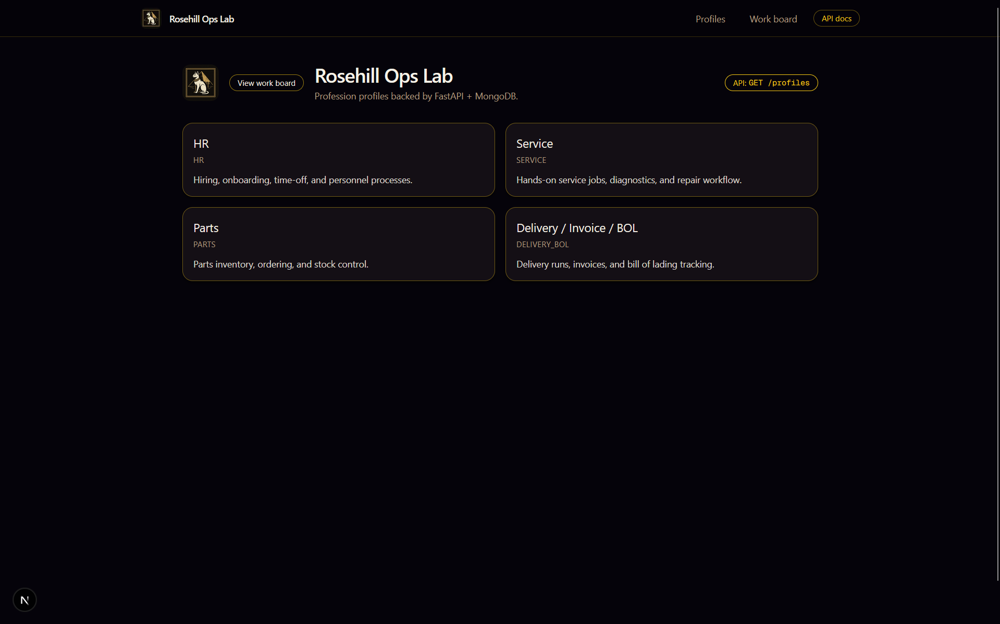
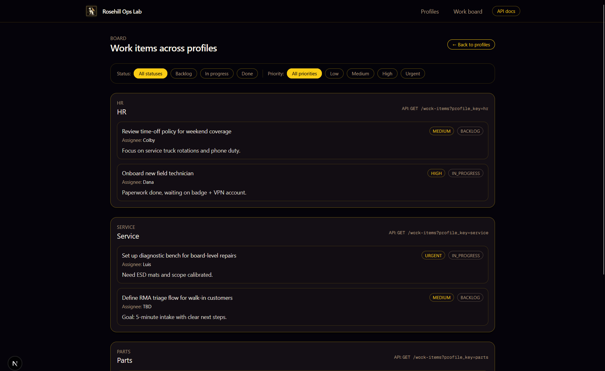

# Rosehill Ops Lab

Profession profiles backed by **FastAPI + MongoDB**, with a **Next.js** front-end for tracking work across HR, Service, Parts, and Delivery / BOL.

The stack is wired for local development with Docker (MongoDB + FastAPI API) and a separate Next.js dev server.

---

## Features

- **Profiles directory**

  - HR, Service, Parts, Delivery / Invoice / BOL profiles.
  - Each profile has a label and description stored in MongoDB and served via FastAPI (`GET /profiles`).

- **Per-profile work items**

  - Work items belong to a `profile_key` (e.g. `service`, `hr`, `parts`, `delivery_bol`).
  - Each item tracks title, status, priority, assignee, and notes.
  - Profile page calls `GET /work-items?profile_key={key}`.

- **Cross-profile work board**

  - Board view groups work items by profile.
  - Filter bar for **status** (`backlog`, `in_progress`, `done`) and **priority** (`low`, `medium`, `high`, `urgent`).
  - Back-link to the profiles dashboard.

- **Create / edit flow**

  - On each profile page:
    - Form to create a new work item for that profile.
    - Inline controls to change **status** and **priority** (saves via API).
  - Front-end expects:
    - `POST /work-items` → create new item.
    - `PUT /work-items/{id}` → update existing item.

- **Navigation shell**
  - Shared header with:
    - Rosehill Ops logo.
    - Links to **Profiles**, **Work board**, and **API docs** (`/docs` on the FastAPI server).
  - Consistent Rosehill dark + gold color palette.

---

## Architecture

Monorepo layout:

```text
rosehill-ops-lab/
├── apps/
│   ├── api/            # FastAPI app (Python)
│   └── web/            # Next.js 16 app (TypeScript + Tailwind)
├── infra/
│   └── docker/
│       └── docker-compose.dev.yml  # MongoDB, mongo-express, API container
└── README.md
```

# High-level data flow:

1. MongoDB stores profiles and work_items.
2. FastAPI exposes REST endpoints over that data.
3. Next.js (apps/web) calls the API using NEXT_PUBLIC_API_BASE_URL.
4. UI renders:

- `/` – profiles grid.
- `/profiles/[profileKey]` – per-profile work items.
- `/work-items` – cross-profile board.

---

# Getting started

Prerequisites

- Python 3.11+
- Node.js 18+ (recommended 20)
- Docker + Docker Compose
- `git`

**1. Clone the repo**

```bash
git clone https://github.com/your-user/rosehill-ops-lab.git
cd rosehill-ops-lab
```

**2. Enviromental variables**
web (Next.js)
create `apps/web/.env.local`:

```env
NEXT_PUBLIC_API_BASE_URL=http://127.0.0.1:8000
```

> This tells the web app where to find the FastAPI server

**API (FastAPI)**

> If you are using defaults from infra/docker/docker-compose.dev.yml, no extra config should be needed.

> If you want to override Mongo settings, add an .env in apps/api and wire it into your FastAPI settings module.

Example (adjust to your actual code):

```env
MONGO_URI=mongodb://mongo:27017/rosehill_ops_lab
MONGO_DB_NAME=rosehill_ops_lab
```

**Start MongoDB + API via Docker**

> From repo root:

```bash
docker compose -f infra/docker/docker-compose.dev.yml up --build
```

This will start:

`rosehill-ops-mongo` – MongoDB

`rosehill-ops-mongo-express` – mongo-express UI

`rosehill-ops-api` – FastAPI app (listening on `http://127.0.0.1:8000`)

You can view the database UI at:

`http://localhost:8081` (mongo-express)

You can view the API docs at:

`http://127.0.0.1:8000/docs` (FastAPI Swagger UI)

Leave this process running while you work.

**Start the Next.js app**

```bash
cd apps/web
npm install   # first time only
npm run dev
```

> Open the web UI:

- `http://localhost:3000`

# Key routes

## Web (Next.js)

- `/`
  Profiles dashboard (HR, Service, Parts, Delivery / BOL).
  Calls `GET /profiles`.

`/profiles/[profileKey]`

- Detail page for a single profile.
- Shows description and work items.
- Create form for new work item.
- Inline status/priority editing.
  Calls:
- `GET /work-items?profile_key={key}`
- `POST /work-items`
- `PUT /work-items/{id}`
- `/work-items`
  Cross-profile board.
- Groups work items by profile.
- Filter bar for status + priority.
  Calls:
- `GET /profiles`
- `GET /work-items`

### Profiles dashboard



### Service profile work items


### Work board


